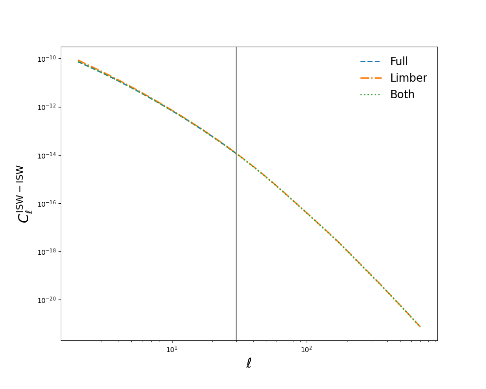
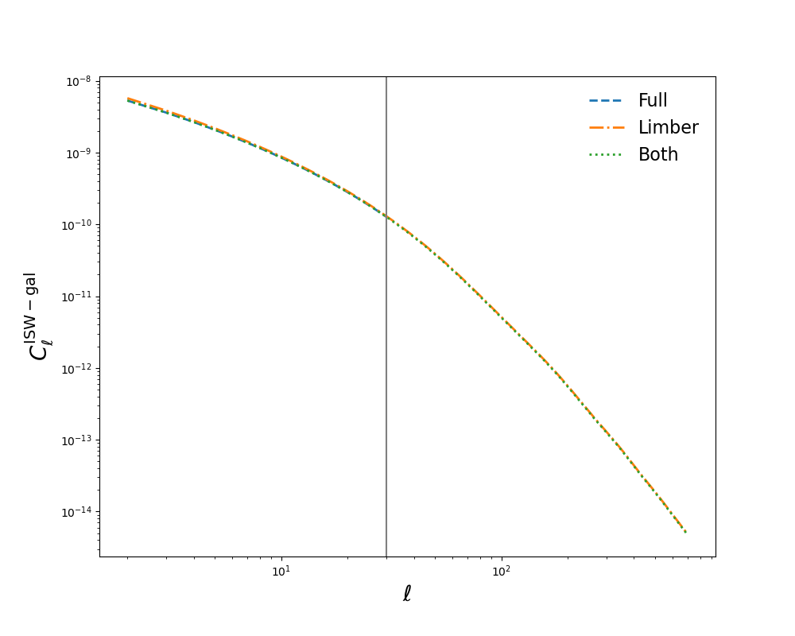
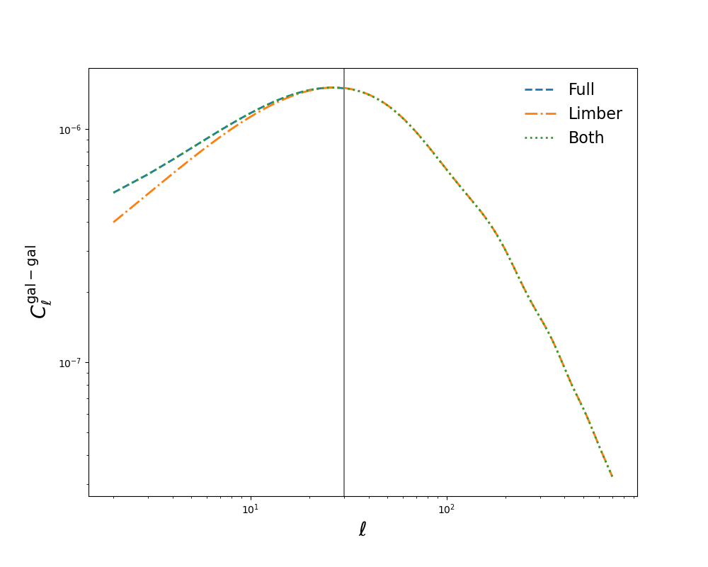
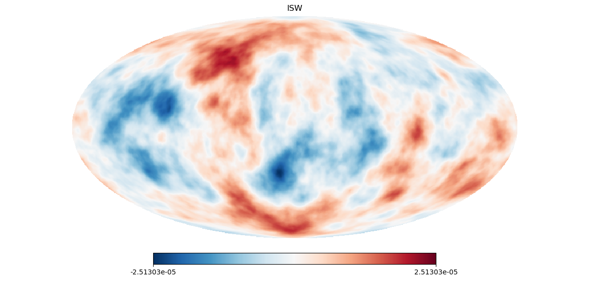
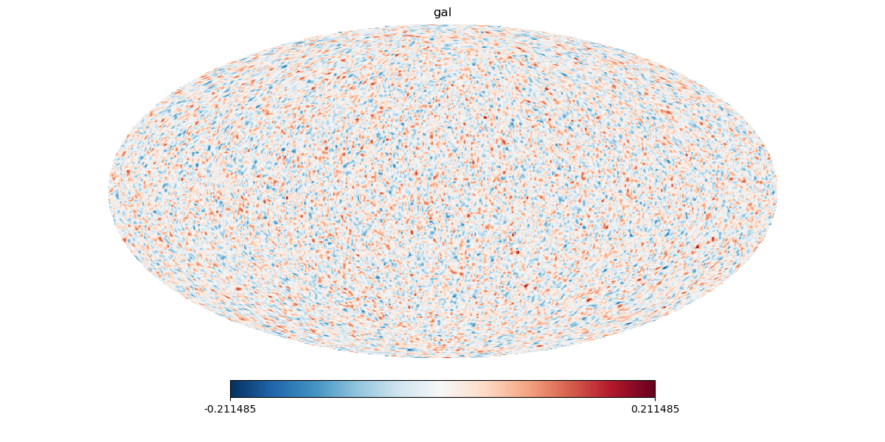

# TheoryCL -- IN DEVELOPMENT

TheoryCL is a python module for computing the theoretical auto- and cross- angular power spectra for the integrated Sachs-Wolfe, galaxy/matter distribution and lensing computed either from a top-hat sample distribution or from a given redshift distribution.

Note: aspect of the code that run lensing have not fully been tested yet.

## Dependencies

* `numpy`
* `scipy`
* `camb`

## Installation

Clone the github repository:

```
git clone https://github.com/knaidoo29/TheoryCL
```

To install use pip:

```
cd TheoryCL
pip install -e . [--user]
```

or use setup:

```
cd TheoryCL
python setup.py build
python setup.py install
```

## Tutorial

Tutorial notebooks are provided in the notebooks folder. The basic usage of TheoryCL are show below where we first use TheoryCL to calculate the Cls for the ISW and matter distribution between redshift 0 and 1.4.

```
import numpy as np
import matplotlib.pylab as plt
import healpy as hp
import TheoryCL

SCL = TheoryCL.SourceCL(TheoryCL.CosmoLinearGrowth())

# Set cosmology
SCL.cosmo(omega_m=0.25, omega_l=0.75, h0=0.7, omega_b=0.044, ns=0.95, As=2.45e-9, sigma8=0.8)

# Creates a table of the following linear growth functions for later interpolation:
# - r : comoving distance
# - H : Hubble parameter
# - D : linear growth rate
# - f : dlnD/dlna via approximation.
SCL.calc_table(zmin=0., zmax=10., zbin_num=10000, zbin_mode='log')

# Calculates the linear power spectra using CAMB and create callable interpolator.
SCL.calc_pk()

lmax = 700 # maximum l mode to compute CLs.
zmin = 0. # minimum redshift integrals along the line-of-sight are computed to.
zmax = 5. # maximum redshift to which integrals along the line-of-sight are computed to.
rbin_num = 1000 # number of bins along radial coordinates for integration.
rbin_mode = 'linear' # linear or log binning schemes.
kmin = None # minimum k for integrals, if None defaults to minimum value pre-calculated by CAMB.
kmax = 1. # maximum k for integrals
kbin_num = 1000 # number of bins in Fourier coordinates for integration.
kbin_mode = 'log' # linear or log binning schemes.
switch2limber = 30 # beyond this l we only compute the CLs using the Limber/flat-sky approximation.
SCL.setup(lmax, zmin=zmin, zmax=zmax, rbin_num=rbin_num, rbin_mode=rbin_mode,
          kmin=kmin, kmax=kmax, kbin_num=kbin_num, kbin_mode=kbin_mode,
          switch2limber=switch2limber)

# Define sources, for example the ISW and matter distribution between redshift 0 and 1.4.

zmin, zmax = 0., 1.4
SCL.set_source_ISW(zmin, zmax)
SCL.set_source_gal_tophat(zmin, zmax, 1.) # the 1. is the linear bias

SCL.get_CL()

# The CLs can be called:

CL_full = SCL.CLs_full # no Limber approximation for l <= switch2limber
CL_approx = SCL.CLs_approx # Limber approximation

# Lastly no limber for l <= switch2limber and then Limber approximation with
# amplitude correction calculated from the ratio of the full and limber approximation
# for switch2limber - 5 <= l <= switch2limber.
CL = SCL.CLs
```

This gives us the following Cls:







These Cls can now be used to generate correlated Healpix maps:

```
SCL.prep4heal() # prepare CLs for healpy.

# Simulate healpix maps with the theoretical CLs calculated with:
sim_nside = 256 # healpix nside
sim_lmax = 200 # maximum l

SCL.simulate(sim_lmax, sim_nside)
```




## Citing

More details will be provided once the code is official released.

## Support

If you have any issues with the code or want to suggest ways to improve it please open a new issue ([here](https://github.com/knaidoo29/TheoryCL/issues))
or (if you don't have a github account) email _krishna.naidoo.11@ucl.ac.uk_.
